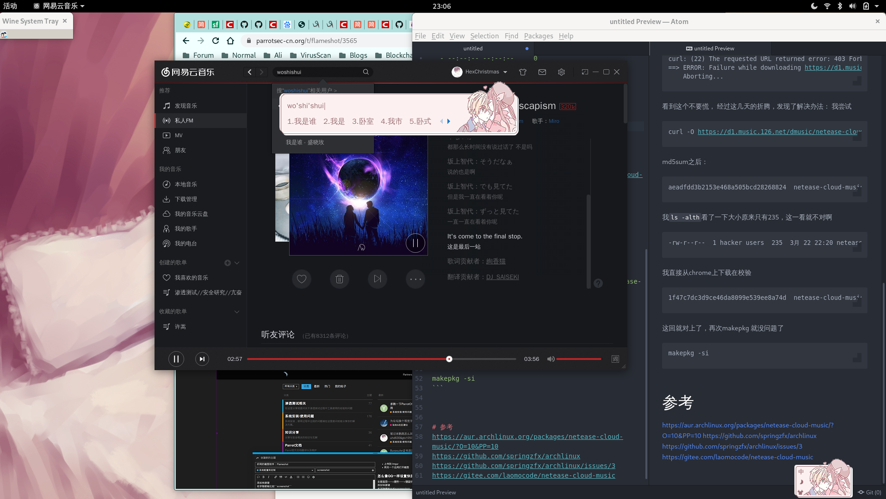

# Archlinux网易云音乐无法中文问题
## 背景
> 据开发者laomocode研究，linux网易云音乐是依赖深度的qcef的qt库。Ubuntu没有qcef这个库所以网易云就自带了qcef，但网易云自带的qcef貌似有问题，所以将网易云自带的qcef库删掉强制使用archlinux版本的qcef。但由于qcef包被官方源也没有同步到aur中，所以只能通过编译qcef进行安装。
## 解决
```
git clone https://github.com/HexChristmas/archlinux &&cd archlinux
```
### compile qcef 1.1.6,时间会比较久一点建议开代理
```
cd qcef
makepkg -si
```
### build
```
cd netease-cloud-music
```
### 执行makepkg -si这步骤的时候会出现一点问题，会出现：
```
==> Making package: netease-cloud-music 1.2.1-1 (Tue 03 Mar 2020 11:24:49 PM CST)
==> Checking runtime dependencies...
==> Checking buildtime dependencies...
==> Retrieving sources...
  -> Downloading netease-cloud-music_1.2.1_amd64_ubuntu_20190428.deb...
  % Total    % Received % Xferd  Average Speed   Time    Time     Time  Current
                                 Dload  Upload   Total   Spent    Left  Speed
  0     0    0     0    0     0      0      0 --:--:-- --:--:-- --:--:--     0
curl: (22) The requested URL returned error: 403 Forbidden
==> ERROR: Failure while downloading https://d1.music.126.net/dmusic/netease-cloud-music_1.2.1_amd64_ubuntu_20190428.deb
    Aborting...
```
看到这个不要慌，
经过这几天的折腾，发现了解决办法：
我尝试
```
curl -O https://d1.music.126.net/dmusic/netease-cloud-music_1.2.1_amd64_ubuntu_20190428.deb
```
md5sum之后：
```
aeadfdd3b2153e468a505bcd28268824  netease-cloud-music_1.2.1_amd64_ubuntu_20190428.deb

```
我```ls -alth```看了一下大小原来只有235，这一看就不对啊
```
-rw-r--r--  1 hacker users  235  3月 22 22:20 netease-cloud-music_1.2.1_amd64_ubuntu_20190428.deb
```
我直接从chrome上下载在校验
```
1f47c7dc3d9ce46da8099e539ee8a74d  netease-cloud-music_1.2.1_amd64_ubuntu_20190428.deb
```
这回就对上了，再次makepkg 就没问题了
```
mv netease-cloud-music_1.2.1_amd64_ubuntu_20190428.deb /home/hacker/archlinux/netease-cloud-music
```

```
makepkg -si
```

# 参考
https://aur.archlinux.org/packages/netease-cloud-music/?O=10&PP=10
https://github.com/springzfx/archlinux
https://github.com/springzfx/archlinux/issues/3
https://gitee.com/laomocode/netease-cloud-music

